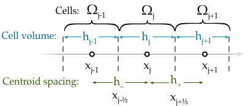
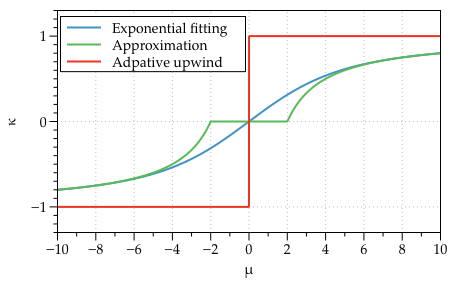

The advection-diffusion-reaction equation
-----------------------------------------

The advection-diffusion-reaction equation (also called the continuity equation in semiconductor physics) in flux form, is given by,

.. math::
	u_t = (\mathcal{-F})_x + s(t,x,u)

where :math:`\mathcal{F} = au - du_x`. This expression holds over the whole domain, therefore it must also hold over a subdomain :math:`\Omega_j=(x_{j-1/2}, x_{j+1/2})`. Integrating over the subdomain, or cell, gives,
	
.. math::
	\int_{x_{j-1/2}}^{x_{j+1/2}} u_t~dx = \int_{x_{j-1/2}}^{x_{j+1/2}} (\mathcal{-F})_x~dx + \int_{x_{j-1/2}}^{x_{j+1/2}} s(x,t,u)~dx

If we now use :math:`w` to represent the cell averages then we don't have to perform the actual integrations,

.. math::
	w_j^{\prime} =  -\frac{\mathcal{F}_{j+1/2}}{h_j} + \frac{\mathcal{F}_{j-1/2}}{h_{j}} + \bar{s}_j

For the advection component of the flux we will use a linear interpolation (see the next section) to determine the contribution at the cell faces, and for the diffusion component with will use a simple cell average,

.. math::
	\mathcal{F}_{j+\frac{1}{2}} = a_{j+\frac{1}{2}}\left( \frac{h_{j+1}}{2h_{+}} w_j + \frac{h_j}{2h_{+}} w_{j+1} \right) - d_{j+\frac{1}{2}} \frac{w_{j+1}-w_j}{h_{+}}

.. math::
	\mathcal{F}_{j-\frac{1}{2}} = a_{j-\frac{1}{2}}\left( \frac{h_{j}}{2h_{-}} w_{j-1} + \frac{h_{j-1}}{2h_{-}} w_{j} \right) - d_{j-\frac{1}{2}} \frac{w_{j}-w_{j-1}}{h_{-}}

The meaning of the "h" terms is shown in the figure below,

   Finite volume cells with important distances and positions labelled.
  
Substituting the definition of the fluxes into the above equation yields,

.. math::
	w_j^{\prime} = \frac{w_{j-1}}{h_j} \left( \frac{a(x_{j-\frac{1}{2}}) h_j}{2h_{-}} + \frac{d(x_{j-\frac{1}{2}})}{h_{-}}\right) + \frac{w_j}{h_j}\left( \frac{a(x_{j-\frac{1}{2}})h_{j-1}}{2h_{-}} - \frac{a(x_{j+\frac{1}{2}})h_{j+1}}{2h_{+}} - 	\frac{d(x_{j-\frac{1}{2}})}{h_{-}} - \frac{d(x_{j+\frac{1}{2}})}{h_{+}}  \right) + \frac{w_{j+1}}{h_j} \left( \frac{-a(x_{j+\frac{1}{2}})h_j}{2h_{+}} + \frac{d(x_{j+\frac{1}{2}})}{h_{+}} \right)

This equation is the *semi-discrete* form.

Adaptive upwinding & exponential fitting
****************************************

Hundsdorfer (on pg. 266) notes that a adaptive upwinding scheme can be introduced by altering the diffusion coefficient,

.. math::
	d(x_{j}) \rightarrow d(x_{j}) + \frac{1}{2}\kappa_{j} h_{j} a(x_{j})

.. math::
	\kappa=\text{sgn}(a(x_{j})). 

Here the nature of the discretisation is defined by the sign of the :math:`a`, when :math:`a\neq0` the scheme results in an upwind discretisation. Only if :math:`a=0` (corresponding to the diffusion equation limit) does the scheme become based on a central difference (see the red line in the Figure below). A generalisation is possible by choosing a function for :math:`\kappa` which automatically adjusts the discretisation method depending on the local value of Peclet's number, :math:`\mu=ah/d`. Exponential fitting has shown to be a robust scheme for steady-state approaches. Exponential fitting can be introduced by,

.. math::
	 \kappa = \frac{e^{\mu}+1}{e^{\mu}-1} - \frac{2}{\mu}

An approximation to the above, which does not require the evaluation of exponentials is commonly used,

.. math::
	\kappa = \begin{cases}
	\text{max}(0, 1-2/\mu) & \text{when}~ \mu>0 \\	
	\text{min}(0, -1-2/\mu) & \text{when}~ \mu<0
	\end{cases}

This is a very elegant want to introduce adaptive upwinding or exponential fitting because it can be brought into the discretisation in an ad hoc manner. Note that for all of the adaptive expressions :math:`\kappa\rightarrow\pm1` as :math:`\mu\rightarrow\pm\infty`, and :math:`\kappa\rightarrow 0` as :math:`\mu\rightarrow 0`. This means the discretisation will automatically weight in the favour of the upwind scheme in locations where advection dominates. Conversely, where diffusion dominates the weighting factor shifts in favour of a central difference scheme.

Naturally resolved Robin boundary conditions
********************************************

`Within the finite volume method Robin boundary conditions are naturally resolved <http://scicomp.stackexchange.com/questions/7650/how-should-boundary-conditions-be-applied-when-using-finite-volume-method>`_. This means that there is no need for interpolation or ghost point substitution (although these approaches remain possible) to include the boundary conditions because the flux at the boundary appears naturally in the semi-discretised equation. For example consider the semi-discretised equation evaluated at the boundary cell :math:`\Omega_1`,

.. figure:: img/boundary_cell_FVM.png
   :scale: 100 %
   :alt: Finite volume boundary cell at the left hand side.
   :align: center

   Finite volume boundary cell at the left hand side.

.. math::
	w_1^{\prime} =  -\frac{\mathcal{F}_{3/2}}{h_1} + \frac{\mathcal{F}_{1/2}}{h_{1}} + \bar{s}_1

The Robin boundary condition specifies the flux at :math:`x_{1/2}`,

.. math::
	\mathcal{F}_{1/2} = g_{R}(x_{1/2})

Therefore the boundary condition can be incorporated without invoking any information regarding the ghost cell,

.. math::
	w_1^{\prime} = \frac{w_1}{h_1}\left( \frac{-a(x_{3/2})h_{2}}{2h_{+}} - \frac{d(x_{3/2})}{h_{+}} \right) + \frac{w_{2}}{h_1} \left( \frac{-a(x_{3/2}) h_1}{2h_{+}} + \frac{d(x_{3/2})}{h_{+}} \right) + \frac{g_{R}(x_L)}{h_1} + \bar{s}_1

Similarly applying the same procedure to the :math:`\Omega_J` cell at the right hand side boundary,

.. figure:: img/boundary_cell_FVM_rhs.png
   :scale: 100 %
   :alt: Finite volume boundary cell at the right hand side.
   :align: center

   Finite volume boundary cell at the right hand side.

.. math::
	w_J^{\prime} =  -\frac{\mathcal{F}_{J+1/2}}{h_J} + \frac{\mathcal{F}_{J-1/2}}{h_J} + \bar{s}_J

The Robin boundary condition at the right hand side is,

.. math::
	g_{R}(x_R) = \mathcal{F}_{J+1/2}

Therefore the naturally resolved boundary condition on the right hand side becomes,

.. math::
	w_J^{\prime} = \frac{w_{J-1}}{h_J}\left( \frac{a(x_{J-1/2})h_{J}}{2h_{-}} + \frac{d(x_{J-1/2})}{h_{-}} \right) + \frac{w_{J}}{h_J} \left( \frac{a(x_{J-1/2}) h_{J-1}}{2h_{-}} - \frac{d(x_{J-1/2})}{h_{-}} \right) - \frac{g_{R}(x_R)}{h_J} + \bar{s}_J

The :math:`\theta`-method
*************************

The :math:`\theta`-method is an approach which improves the stability and numerical accuracy when integrating a partial differential equation in time. It consists of writing the equation as the time average of the current and future time step. When :math:`\theta=0` a fully explicit scheme is recovered in which the future state of the system is derived purely from the current state. Conversely,  :math:`\theta=1` gives a fully implicit formalism, in which a linear system of equation is solved to determine the future state. Setting :math:`\theta=1/2` results in an average of these two limits and it is generally causes the the Crank-Nicolson method. Crank-Nicolson provides unconditionally stable iterations for the advection and diffusion equations, and the improves the time integration (it corresponds to a trapezium integration in the time domain).

.. math::
	\frac{w_j^{n+1} - w_j^n}{k} = \theta r_a w_{j-1}^{n+1} + (1 - \theta) r_a w_{j-1}^{n} + \theta r_b w_{j-1}^{n+1}  + (1 - \theta) r_b w_{j-1}^{n} +  \theta r_c w_{j-1}^{n+1}  + (1 - \theta) r_c w_{j-1}^{n} + \bar{s}_j^n

In the above :math:`k` stands for the difference in time, the :math:`n+1` are the terms at the future time point, and :math:`n` terms are the current time point. The ":math:`r`" terms are the coefficients of the semi-discretised equation. Moving the unknowns to the left hand side,

.. math::
	w_j^{n+1} - \theta k r_a w_{j-1}^{n+1} - \theta k r_b w_{j}^{n+1} - \theta k r_c w_{j+1}^{n+1} = w_j^{n} + (1 - \theta) k r_a w_{j-1}^{n} + (1 - \theta) k r_b w_{j}^{n} + (1 - \theta) k r_c w_{j1}^{n} + k \bar{s}_j^n
	
Defining the coefficients for to include the time step,

.. math::
	r_a & = \frac{k}{h_j} \left( \frac{a(x_{j-\frac{1}{2}}) h_j}{2h_{-}}  + \frac{d(x_{j-\frac{1}{2}})}{h_{-}}\right) \\
	r_b & = \frac{k}{h_j}\left( \frac{a(x_{j-\frac{1}{2}})h_{j-1}}{2h_{-}} - \frac{a(x_{j+\frac{1}{2}})h_{j+1}}{2h_{+}} - \frac{d(x_{j-\frac{1}{2}})}{h_{-}} - \frac{d(x_{j+\frac{1}{2}})}{h_{+}}  \right)\\
	r_c & = \frac{k}{h_j} \left( \frac{-a(x_{j+\frac{1}{2}})h_j}{2h_{+}} + \frac{d(x_{j+\frac{1}{2}})}{h_{+}} \right)

Discretised equation in matrix form
***********************************

Here we present a general matrix equation,

.. math::
	\boldsymbol{A}\cdot\boldsymbol{w}^{n+1} = \boldsymbol{M}\cdot\boldsymbol{w}^{n} + \boldsymbol{s} + \boldsymbol{b}
	
for the discretisation of the advection-diffusion equation that can be easily modified to include Robin or Dirichlet boundary conditions.

Where the left hand side is,

.. math::
	\begin{align} 
	\begin{pmatrix}
	b_1 & c_1    &        &       & 0   \\
	a_2 & 1-\theta r_b    & -\theta r_c    &       &     \\
	    & \ddots & \ddots & \ddots&     \\
	    &        &  - \theta r_a   & 1-\theta r_b   & c_{J-1} \\
	 0  &        &        & a_J   & b_J
	\end{pmatrix}
	\begin{pmatrix}
	    w_1^{n+1} \\
	    w_2^{n+1} \\
	    \vdots \\
	    w_{J-1}^{n+1} \\
	    w_J^{n+1} \\
	\end{pmatrix}
	\end{align}

and the right hand side,

.. math::
	\begin{align}
	\begin{pmatrix}
	b_1 & c_1   &        &       & 0   \\
	a_2 & 1+(1-\theta)r_b    & (1-\theta)r_c    &       &     \\
	    & \ddots & \ddots & \ddots&     \\
	    &        &  (1-\theta)r_a   & 1+(1-\theta)r_b   & c_{J-1} \\
	 0  &        &        & a_J  & b_J
	\end{pmatrix}
	\begin{pmatrix}
	    w_1^n \\
	    w_2^n \\
	    \vdots \\
	    w_{J-1}^n \\
	    w_J^n \\
	\end{pmatrix} + k
	\begin{pmatrix}
	    s_1^n \\
	    s_2^n \\
	    \vdots \\
	    s_{J-1}^n \\
	    s_J^n\\
	\end{pmatrix} + 
	\begin{pmatrix}
	    c_1 \\ %k g_R(x_L)/h_1 \\
	    c_2 \\%0 \\
	    \vdots \\
	    c_{J-1} \\%0 \\
	    c_{J} \\%-k g_R(x_R)/h_J\\
	\end{pmatrix}
	\end{align}

Notice the terms in the top-left and bottom-right corners of the matrices have been modified, these are the terms that need to be changed to implement the boundary conditions. In addition to altering the matrix equation, a new vector as been introduced on the right hand side which carrier the boundary condition values.

Implementing Robin boundary conditions
**************************************

To implement Robin boundary conditions the terms belonging to :math:`\boldsymbol{A}` become the following,

.. math::
	\begin{align}
	b_1 & = 1 - \theta \frac{k}{h_1}\left( -\frac{a(x_{3/2})h_2}{2h_{+}} - \frac{d(x_{3/2})}{h_{+}} \right) \\
	c_1 & = - \theta \frac{k}{h_1}\left( -\frac{a(x_{3/2})h_1}{2h_{+}} + \frac{d(x_{3/2})}{h_{+}} \right) \\
	a_2 & = -\theta r_a \\
	c_{J-1} & = -\theta r_c \\
	a_J & = -\theta \frac{k}{h_J}\left( \frac{a(x_{J-1/2})h_J}{2h_{-}} + \frac{d(x_{J-1/2})}{h_{-}} \right) \\
	b_J & = 1-\theta \frac{k}{h_J}\left( \frac{a(x_{J-1/2})h_{J-1}}{2h_{-}} - \frac{d(x_{J-1/2})}{h_{-}} \right) \\
	\end{align}

The terms belonging to :math:`\boldsymbol{M}` become the following, 

.. math::
	\begin{align}
	b_1 & = 1 + (1 - \theta) \frac{k}{h_1}\left( -\frac{a(x_{3/2})h_2}{2h_{+}} - \frac{d(x_{3/2})}{h_{+}} \right) \\
	c_1 & = (1 - \theta)\frac{k}{h_1}\left( -\frac{a(x_{3/2})h_1}{2h_{+}} + \frac{d(x_{3/2})}{h_{+}} \right) \\
	a_2 & = (1 - \theta) r_a \\
	c_{J-1} & = (1 - \theta) r_c \\
	a_J & = (1 - \theta)\frac{k}{h_J}\left( \frac{a(x_{J-1/2})h_J}{2h_{-}} + \frac{d(x_{J-1/2})}{h_{-}} \right) \\
	b_J & = 1 + (1 - \theta) \frac{k}{h_J}\left( \frac{a(x_{J-1/2})h_{J-1}}{2h_{-}} - \frac{d(x_{J-1/2})}{h_{-}} \right) \\
	\end{align}
	
The elements of the boundary condition vector are all zero with the following exception,

.. math::
	c_1 = k\frac{g_D(x_{L})}{h_1} \\
	c_J = k\frac{g_D(x_{R})}{h_J}

Implementing Dirichlet boundary conditions
******************************************

To implement Dirichlet boundary conditions the terms belonging to :math:`A` become the following,

.. math::
	\begin{align}
	b_1 & = 1 \\
	c_1 & = 0 \\
	a_2 & = 0 \\
	c_{J-1} & = 0\\
	a_J & = 0 \\
	b_J & = 1 \\
	\end{align}

The terms belonging to :math:`M` become the following,

.. math::
	\begin{align}
	b_1 & = 0 \\
	c_1 & = 0 \\
	a_2 & = 0 \\
	c_{J-1} & = 0\\
	a_J & = 0 \\
	b_J & = 0 \\
	\end{align}
	
The elements of the boundary condition vector are all zero with the exception of the following elements,

.. math::
	\begin{align}
	c_1 & = g_D(x_{L}) \\
	c_J & = r_a g_D(x_{L}) \\
	c_{J-1} & = r_c g_D(x_{R}) \\
	c_J & = g_D(x_{R}) \\
	\end{align}

**NB** it is *not* an error that the time step is *not* included in the boundary condition vector.

Aside :math:`-` Linear interpolation between cell centre and face values
=========================================================================

In general, linear interpolation between two points :math:`(x_0, x_1)` can be used to find the value of a function at :math:`f(x)`,

.. math::
	f(x) = \frac{x - x_1}{x_0 - x_1}f(x_0) + \frac{x - x_0}{x_1 - x_0}f(x_1)

In a cell centred grid we know the value of the variable :math:`w` at difference points, :math:`w_j` and :math:`w_{j+1}`. We can apply the linear interpolation formulae above to determine value at cell face :math:`w_{j+1/2}`.

.. math::
	w_{j+1/2} =  \frac{x_{j+1/2} - x_{j+1}}{x_{j} - x_{j+1}} w_j + \frac{x_{j+1/2} - x_j}{x_{j+1} - x_j} w_{j+1} 

This can be simplified firstly by using function to represent the distance between cell centres,

.. math::
	h_{-} = x_j - x_{j-1} \quad h_{+} = x_{j+1} - x_{j}

to give, 

.. math::
	w_{j+1/2} = \frac{x_{j+1} - x_{j+1/2}}{h_{+}} w_j + \frac{x_{j+1/2} - x_j}{h_{+}} w_{j+1}

This expression still contains :math:`x_{j+1/2}` which we can simplify further by using an expression for the position of cell centres,

.. math::
	x_j = \frac{1}{2} \left( x_{j-\frac{1}{2}} + x_{j+\frac{1}{2}} \right) \quad x_{j+1} = \frac{1}{2} \left( x_{j+\frac{1}{2}} + x_{j+\frac{3}{2}} \right)

Note, this expression is still valid of non-uniform grids, it simply says that cell centres are always equidistant from two faces. Rearranging the above expression and substituting in for :math:`x_{j}` and :math:`x_{j+1}` terms gives, 

.. math::
	w_{j+1/2} = \frac{\frac{1}{2} \left( x_{j+\frac{1}{2}} + x_{j+\frac{3}{2}} \right) - x_{j+1/2}}{h_{+}} w_j + \frac{x_{j+1/2} - \frac{1}{2} \left( 	x_{j-\frac{1}{2}} + x_{j+\frac{1}{2}} \right)}{h_{+}} w_{j+1}

Finally, by defining the distance between vertices as, :math:`h_j = x_{j+\frac{1}{2}} - x_{j-\frac{1}{2}}`, we can simplify to the following expression,

.. math::
	w_{j+1/2} = \frac{h_{j+1}}{2h_{+}} w_j + \frac{h_j}{2h_{+}} w_{j+1}

Similarly the :math:`w_{j-1/2}` can be found,

.. math::
	w_{j-1/2} = \frac{h_{j}}{2h_{-}} w_{j-1} + \frac{h_{j-1}}{2h_{-}} w_{j}

