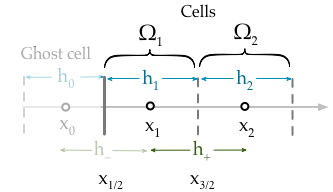

Boundary conditions for the advection-diffusion-reaction equation
-----------------------------------------------------------------

A well posed problem requires boundary conditions.

Robin boundary conditions (known flux)
**************************************

`Within the finite volume method Robin boundary (known flux) conditions are naturally resolved <http://scicomp.stackexchange.com/questions/7650/how-should-boundary-conditions-be-applied-when-using-finite-volume-method>`_. This means that there is no need for interpolation or ghost point substitution (although these approaches remain possible) to include the boundary conditions because the flux at the boundary appears naturally in the semi-discretised equation. For example consider the semi-discretised equation evaluated at the boundary cell :math:`\Omega_1`,

   Finite volume boundary cell at the left hand side.

.. math::
	w_1^{\prime} =  -\frac{\mathcal{F}_{3/2}}{h_1} + \frac{\mathcal{F}_{1/2}}{h_{1}} + \bar{s}_1

The Robin boundary condition specifies the flux at :math:`x_{1/2}`,

.. math::
	\mathcal{F}_{1/2} = g_{R}(x_{1/2})

Therefore the boundary condition can be incorporated without invoking any information regarding the ghost cell,

.. math::
	w_1^{\prime} = \frac{w_1}{h_1}\left( \frac{-a(x_{3/2})h_{2}}{2h_{+}} - \frac{d(x_{3/2})}{h_{+}} \right) + \frac{w_{2}}{h_1} \left( \frac{-a(x_{3/2}) h_1}{2h_{+}} + \frac{d(x_{3/2})}{h_{+}} \right) + \frac{g_{R}(x_L)}{h_1} + \bar{s}_1

Similarly applying the same procedure to the :math:`\Omega_J` cell at the right hand side boundary,

.. figure:: img/boundary_cell_FVM_rhs.png
   :scale: 100 %
   :alt: Finite volume boundary cell at the right hand side.
   :align: center

   Finite volume boundary cell at the right hand side.

.. math::
	w_J^{\prime} =  -\frac{\mathcal{F}_{J+1/2}}{h_J} + \frac{\mathcal{F}_{J-1/2}}{h_J} + \bar{s}_J

The Robin boundary condition at the right hand side is,

.. math::
	g_{R}(x_R) = \mathcal{F}_{J+1/2}

Therefore the naturally resolved boundary condition on the right hand side becomes,

.. math::
	w_J^{\prime} = \frac{w_{J-1}}{h_J}\left( \frac{a(x_{J-1/2})h_{J}}{2h_{-}} + \frac{d(x_{J-1/2})}{h_{-}} \right) + \frac{w_{J}}{h_J} \left( \frac{a(x_{J-1/2}) h_{J-1}}{2h_{-}} - \frac{d(x_{J-1/2})}{h_{-}} \right) - \frac{g_{R}(x_R)}{h_J} + \bar{s}_J

Dirichlet boundary conditions (known value)
*******************************************

.. warning::
    This is only valid provided the initial conditions also satisfy the boundary conditions
    
Dirichlet (known value) boundary conditions are trivial to implement. All that is required is to fix the boundary term to be a constant value. If the initial conditions satisfy the boundary conditions (as they should) then all that is needed to to make sure that the time-derivative (the change with time) of the boundary points is always zero. For example, to impose Dirichlet boundary conditions 

.. math::
    w_1^{n+1} = g_D(x_1) \quad w_{J}^{n+1} = g_D(x_J)
    
We simply need to specify,

.. math::
    F_1(w_1^{n}) = 0 \quad F_1(w_1^{n+1}) = 0

This can be achieved by multiplying the r.h.s. by the modified identity matrix where the first and last elements are zero,

.. math::
    w^{\prime} = \text{diag}(0,1,\cdots,1,0) \left( \theta F(w^{n+1}) + (1-\theta)F(w^{n})  \right)

If the boundary conditions are time dependent,

.. math::
    w_1^{n+1} = g_D(x_1, t_{n+1}) \quad w_{J}^{n+1} = g_D(x_J, t_{n+1})

The we should also add a matrix to the r.h.s. which is contains the changes to the boundary value between the time-steps,

.. math::
    w^{\prime} = \text{diag}(0,1,\cdots,1,0) \left( \theta F(w^{n+1}) + (1-\theta)F(w^{n})  \right) + \text{diag}(\Delta g_D(x_1), 0, \cdots, 0, \Delta g_D(x_J) )

where,

.. math::
    \Delta g_D(x_1) = g_D(x_1, t_{n+1}) - g_D(x_1, t_{n}) \\
    \Delta g_D(x_J) = g_D(x_J, t_{n+1}) - g_D(x_J, t_{n})

The following assumes time-invariant boundary conditions.

General matrix form
*******************

Writing the equation in the form,

.. math::
    w^{\prime} = \alpha\left( \theta F(w_j^{n+1}) + (1-\theta)F(w_j^{n}) \right) + \beta

allows a nice general approach where either type of boundary condition can be enforced simply by changing a few variables. A new matrix, :math:`\alpha` are vector, :math:`\beta` have been included. These used to incorporate the boundary conditions as discussed above, they have the form,

.. math::
    \alpha & = \text{diag}\left( \alpha_1, 1, \cdots, 1, \alpha_J \right) \\
    \beta  & = \left( \beta_1, 0, \cdots, 0, \beta_J \right)

The modified coefficient matrix becomes,

.. math::
    M = 
	\begin{align} 
	\begin{pmatrix}
	b_1 & c_1    &        &       & 0   \\
	r_a & r_b    & r_c    &       &     \\
	    && \ddots & \ddots & \ddots&     \\
	    &&        &  r_a   & r_b   & r_c \\
	 0  &&        &        & a_J   & b_J
	\end{pmatrix}
    \end{align}

Table showing coefficients which should be altered to apply either Robin or Dirichlet boundary conditions.

.. tabularcolumns:: |m{5cm}|m{5cm}|m{5cm}|

+-------------------+--------------------------------------------------------------------------------------------------------------+---------------------+
|   Symbol          |                                         Robin                                                                | Dirichlet           |
+===================+==============================================================================================================+=====================+
| :math:`b_1`       | :math:`\frac{1}{h_1}\left( \frac{-a(x_{3/2})h_{2}}{2h_{+}} - \frac{d(x_{3/2})}{h_{+}} \right)`               | :math:`r_b`         |
+-------------------+--------------------------------------------------------------------------------------------------------------+---------------------+
| :math:`c_1`       | :math:`\frac{1}{h_1} \left( \frac{-a(x_{3/2}) h_1}{2h_{+}} + \frac{d(x_{3/2})}{h_{+}} \right)`               | :math:`r_c`         |
+-------------------+--------------------------------------------------------------------------------------------------------------+---------------------+
| :math:`a_J`       | :math:`\frac{1}{h_J}\left( \frac{a(x_{J-1/2})h_{J}}{2h_{-}} + \frac{d(x_{J-1/2})}{h_{-}} \right)`            | :math:`r_a`         |
+-------------------+--------------------------------------------------------------------------------------------------------------+---------------------+
| :math:`b_J`       | :math:`\frac{1}{h_J} \left( \frac{a(x_{J-1/2}) h_{J-1}}{2h_{-}} - \frac{d(x_{J-1/2})}{h_{-}} \right)`        | :math:`r_b`         |
+-------------------+--------------------------------------------------------------------------------------------------------------+---------------------+
| :math:`\alpha_1`  | :math:`1`                                                                                                    | :math:`0`           |
+-------------------+--------------------------------------------------------------------------------------------------------------+---------------------+
| :math:`\alpha_J`  | :math:`1`                                                                                                    | :math:`0`           |
+-------------------+--------------------------------------------------------------------------------------------------------------+---------------------+
| :math:`\beta_1`   | :math:` \frac{g_R(x_1)}{h_1}`                                                                                | :math:`0`           |
+-------------------+--------------------------------------------------------------------------------------------------------------+---------------------+
| :math:`\beta_J`   | :math:`-\frac{g_R(x_J)}{h_J}`                                                                                | :math:`0`           |
+-------------------+--------------------------------------------------------------------------------------------------------------+---------------------+

As can be seen, Dirichlet conditions require minor modifications (only the component so the :math:`\alpha` matrix are changed). On the other hand, Robin boundary conditions require that the elements of the coefficient matrix are altered (however for Robin conditions the :math:`\alpha` matrix is not required).
