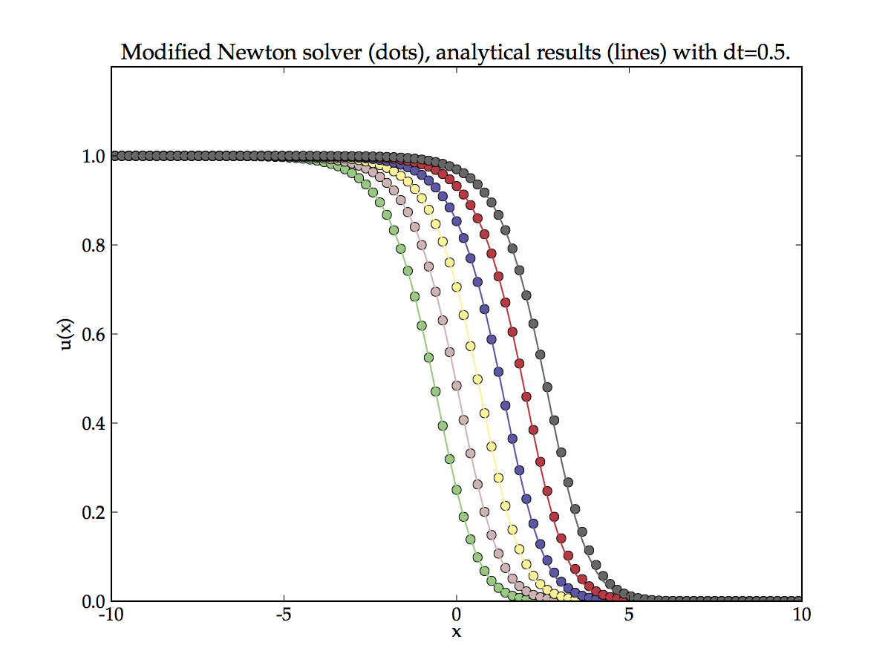

Solving nonlinear equations
---------------------------

.. note::
	Nonlinear equations are defined as those having coefficients of the solution variables which are also functions of the solution variable.
	
In the previous section we discussed how to solve the linear advection-diffusion-reaction equation with method of time stepping. We used the Crank-Nicolson scheme: the implicit terms provides stability (unrestricted time step) and by also using the explicit term the accuracy of the time integration is improved to second order. However, this approach is only valid for linear equations. 

Nonlinear equations (by definition) cannot be written in linear form, as such the time-stepping approach cannot be used. It remains possible to use a fully explicit method, however in practice this is usually not done because the time step is too restrictive or the explicit form is *unconditionally unstable*.

Here we discuss three approach which can be used to solve nonlinear equations:
 
 1. IMEX (implicit/explicit) time-stepping 
 2. Newton iteration
 3. Method of lines

Fisher's equation
*****************

We will use Fishers' nonlinear reaction-diffusion equation as an example because it has an analytical solution,

.. math::
	u_t = d u_{xx} + \beta u(1 - u)

We can directly apply the discretisation scheme already developed, but we must set :math:`a=0` and note the nonlinear reaction term :math:`\betau(1 - u)`. With semi-open boundary condition :math:`u(x_0,t)=1` Fishers' equation has the analytical form,

.. math::
	u(x,t) = \frac{1}{\left(1 + e^{c^{1/2}\left(x - Ut\right)} \right)^2} \\

where :math:`U = 5\left(\frac{1}{c}\right)^{1/2}`, and, :math:`c=\frac{6}{d\beta}`

IMEX time-stepping
******************

The IMEX scheme treats the linear parts of the equation using implicit (or semi-implicit) scheme and the non-linear parts full explicitly. Therefore for Fishers' equation this becomes,

.. math::
	w^{\prime} = \theta M^{n+1}u^{n+1} + (1-\theta) M^{n}u^{n} + \beta u^n(1-u^n)

This can be rearranged into the form :math:`A\cdot x = d` and solved by standard time stepping techniques.

.. figure:: img/IMEX_solution_fvm.png
   :scale: 50 %
   :alt: IMEX solution of Fishers' equation.
   :align: center

Note the poor agreement with the analytical solution for large values of times. IMEX method is known to introduce a global error that grows exponentially with iteration number. The error in the above Figure has been accentuated by deliberately choosing a fairly large time step. A small time step can be used suppress errors. We will now compare the IMEX approach to the Newton scheme.

Newton iteration
****************

.. warning::
	Documentation for the rest of this page is not yet ready to publish.

Method of lines
***************

.. figure:: img/MOL_solution_fvm.png
   :scale: 50 %
   :alt: MOL solution of Fishers' equation.
   :align: center

